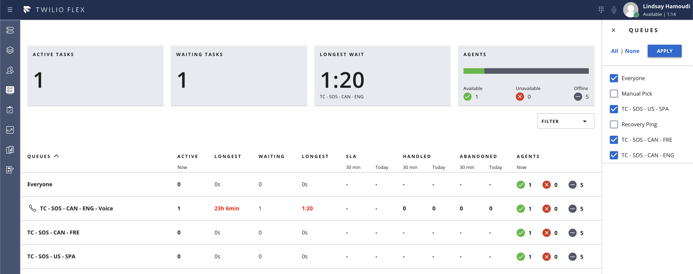

# Custom Queues Stats Customizations Plugin

This basic plugin shows how the components on the Queues Stats View can be customized in numerous ways, as documented at [Real-Time Queues View Programmability](https://www.twilio.com/docs/flex/developer/ui/queues-view-programmability).

Features implemented by this plugin:

* Add a column to `QueuesDataTable` to display "Longest Active" task duration, and stylizing it in red if it exceeds a configurable threshold.
  * “Longest Active” task duration requires digging into the Flex [insightsClient](https://www.twilio.com/docs/flex/developer/ui/manager#insightsclient) using liveQuery on the `tr-task` index - in order to find the longest active one.
  * NOTE: Use of liveQuery has a maximum result set of 200, and since we’ll be independently querying for active tasks on each queue, we’re limited to processing only 200 active tasks per queue at once. If you have a larger number of tasks than this in your queue, consider indicating this by means of a warning icon and hover text next to this stat.
* Change the style of the "Waiting" and "Longest Waiting" columns to display in red if they exceed configurable thresholds



NOTE: This implementation assumes a single channel per queue (e.g. Voice). If your queues serve multiple channels, the customization of the `QueuesDataTable` columns becomes more complex - since instead of each cell being a single stat, it needs to be an HTML `<ul>` element that lists the stats both at the queue level, and at the channel level.

Future Possibilities
* Include worker name for the longest active task - to help track down in Teams View
* Add a Longest Active tile to the top level `AggregatedQueuesDataTiles` section (would need to adapt to any filters too - tricky)

## About Flex Plugins
Twilio Flex Plugins allow you to customize the appearance and behavior of [Twilio Flex](https://www.twilio.com/flex). If you want to learn more about the capabilities and how to use the API, check out our [Flex documentation](https://www.twilio.com/docs/flex).

## Setup

Make sure you have [Node.js](https://nodejs.org) as well as [`npm`](https://npmjs.com). We support Node >= 10.12 (and recommend the _even_ versions of Node). Afterwards, install the dependencies by running `npm install`:

```bash
cd 

# If you use npm
npm install
```

Next, please install the [Twilio CLI](https://www.twilio.com/docs/twilio-cli/quickstart) by running:

```bash
brew tap twilio/brew && brew install twilio
```

Finally, install the [Flex Plugin extension](https://github.com/twilio-labs/plugin-flex/tree/v1-beta) for the Twilio CLI:

```bash
twilio plugins:install @twilio-labs/plugin-flex
```


## Development

In order to develop locally, you can use the Twilio CLI to run the plugin locally. Using your commandline run the following from the root dirctory of the plugin.

```bash
twilio flex:plugins:start
```

This will automatically start up the Webpack Dev Server and open the browser for you. Your app will run on `http://localhost:3000`.

When you make changes to your code, the browser window will be automatically refreshed.


## Deploy

Once you are happy with your plugin, you have to deploy then release the plugin for it to take affect on Twilio hosted Flex.

Run the following command to start the deployment:

```bash
twilio flex:plugins:deploy --major --changelog "Notes for this version" --description "Functionality of the plugin"
```

After your deployment runs you will receive instructions for releasing your plugin from the bash prompt. You can use this or skip this step and release your plugin from the Flex plugin dashboard here https://flex.twilio.com/admin/plugins

For more details on deploying your plugin, refer to the [deploying your plugin guide](https://www.twilio.com/docs/flex/plugins#deploying-your-plugin).

Note: Common packages like `React`, `ReactDOM`, `Redux` and `ReactRedux` are not bundled with the build because they are treated as external dependencies so the plugin will depend on Flex to provide them globally.

